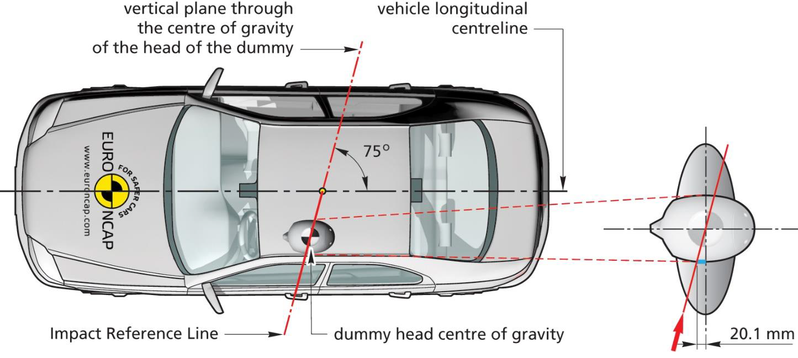
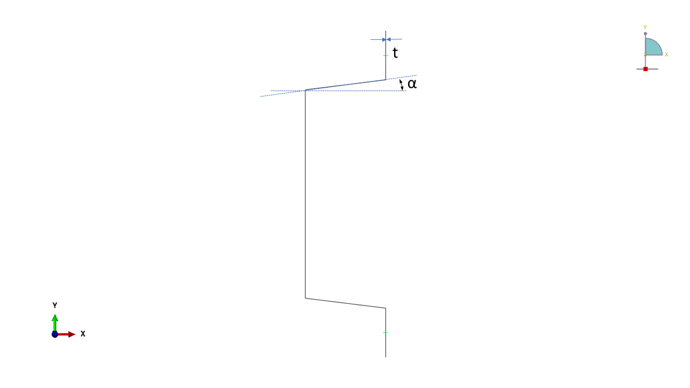
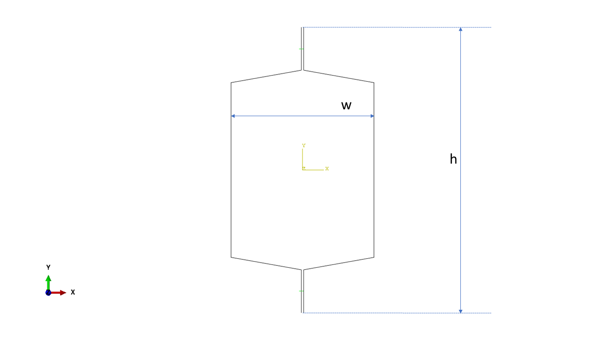

# Multi-Objective Design Optimization of a Vehicle Rocker Sill Assembly

## Table of Contents

[1. Project Description](#1-project-description)  
[2. Problem Statement](#2-problem-statement)  
[3. Numerical Simulation](#3-numerical-simulation) 
&nbsp;&nbsp;&nbsp;&nbsp;[3.1 Rocker Sill Assembly and Design Variables](#31-rocker-sill-assembly-and-design-variables) 
&nbsp;&nbsp;&nbsp;&nbsp;[3.2 Crashworthiness Metrics](#32-crashworthiness-metrics) 
&nbsp;&nbsp;&nbsp;&nbsp;[3.3 FE Model](#33-fe-model) 
&nbsp;&nbsp;&nbsp;&nbsp;[3.4 Automated FE Simulation and Database Generation](#34-automated-fe-simulation-and-database-generation)  
[4. Surrogate Model](#4-surrogate-model) 
&nbsp;&nbsp;&nbsp;&nbsp;[4.1 Correlation Analysis](#41-correlation-analysis) 
&nbsp;&nbsp;&nbsp;&nbsp;[4.2 XGBoost Regression Models](#42-xgboost-regression-models) 
&nbsp;&nbsp;&nbsp;&nbsp;[4.3 Surrogate Model Deployment](#43-surrogate-model-deployment)  
[5. Multi-Objective Design Optimization](#5-multi-objective-design-optimization) 
&nbsp;&nbsp;&nbsp;&nbsp;[5.1 Optimization Problem Formulation](#51-optimization-problem-formulation) 
&nbsp;&nbsp;&nbsp;&nbsp;[5.2 Optimization Function](#52-optimization-function) 
&nbsp;&nbsp;&nbsp;&nbsp;[5.3 Pareto-Optimal Solutions](#53-pareto-optimal-solutions)  
[6. Project Outcome](#6-project-outcome)  
[7. Acknowledgements](#7-acknowledgements)  
[8. References](#8-references)

---

## 1. Project Description

This project investigates the optimal design configurations of a **vehicle rocker sill assembly** under the **European New Car Assessment Programme (Euro NCAP) oblique pole side impact crashworthiness requirements**.

The dynamic bending performance of the rocker sill assembly is investigated using a **multi-objective optimization approach** that combines physics-based **finite element (FE) simulations** with **surrogate modeling techniques**.

A surrogate-based optimization function is formulated using engineering constraints, and evolutionary algorithms are used to explore the design space and generate a diverse set of solutions that simultaneously optimize multiple, conflicting crashworthiness objectives.

## 2. Problem Statement

Vehicle design is a multidisciplinary process in which numerical simulations play a central role. Among the various disciplines involved, **crashworthiness** is critical to vehicle development because it evaluates the structural performance of the **body-in-white (BIW)** and its ability to protect occupants during a collision.

Among several crash scenarios, lateral vehicle collisions have received increased attention in recent years. According to Euro NCAP, vehicles are tested by impacting them against a fixed, rigid pole with a diameter of 254 mm (10 inches). The vehicle travels at a speed up to and including 32 km/h (20 mph) and is positioned at an angle of 75° formed by the impact reference line with the vertical plane through the centre of gravity of the head of the dummy in the driver seating position. The test condition is depicted in figure 1.

  

  <em>Fig 1. Oblique Pole Side Impact Testing Protocol</em>

This study focuses on optimizing the design of a rocker sill assembly for a **Class B battery electric vehicle (BEV)** subjected to an **oblique pole side impact**.

The available design volume of the rocker sill assembly is constrained by the overall vehicle architecture and is derived by considering:

1. Battery size and shape
2. Passenger seating position
3. Other BIW modules, such as the central compartment floor position

## 3. Numerical Simulation

### 3.1 Rocker Sill Assembly and Design Variables

The design of the rocker sill assembly in a BEV is influenced by battery topology, size, its location and other architectural considerations while also adhering to specific design philosophies and vehicle concepts. As a result, the assembly has a constrained design volume, with design choices also inherently restricted by the assembly's role in supporting pillar assemblies and other BIW modules.

Based on benchmarking studies and engineering design knowledge, a **2 m long, 0.1 m wide and 0.2 m high hexagonal-section rocker sill assembly** is investigated in this study. The width and height are denoted as **w** and **h** respectively, as illustrated in figure 2.

Two design variables are considered:

- **Angle** - the geometric parameter defining the shape of the rocker sill section (denoted by **&alpha** as illustrated in figure 2)
- **Thickness** - the component parameter defining the panel thickness (denoted by **t** as illustrated in figure 2)

The baseline model, including the design variables, is depicted in figure 2.

  
  

  <em>Fig 2. Baseline Rocker Sill Assembly FE Model</em>

### 3.2 Crashworthiness Metrics

During a side pole impact, several structural components of the BIW, including the rocker sill assembly, act as major load-bearing components. Their structural performance can be evaluated using different crashworthiness metrics.

In this study, **peak impact force (PCF)** and **energy absorption (EA)** are selected as the output variables for optimization. The rocker sill assembly is required to absorb at least **15% of the energy observed during the side pole impact**.

The design optimization is performed using a representative structural loading scenario. Crashworthiness evaluation is conducted using FE simulations that mimic a **three-point bending test procedure**, given its similarity to impactor test and drop test validation processes commonly used in industry.

### 3.3 FE Model

The FE model information used for the representative oblique pole side impact simulations is summarized below.

| Property | Values |
| --- | --- |
| **Geometry** | Each rocker sill panel is modeled using 6 geometrical points (engineer's choice) |
| | Cylindrical pole modeled as a rigid impactor |
| **Material** | Dual-phase (DP) 780 Steel |
| | Density - 7890 kg/m³ |
| | Young's Modulus - 200 GPa |
| | Poisson's Ratio - 0.3 |
| | Yield Stress - 500 MPa |
| **FE Mesh** | Element type for sill assembly - S4R Shell elements |
| | Element size for sill assembly - 6 mm |
| | Element type for rigid impactor - R3D4 Rigid elements |
| | Element size for rigid impactor - 15 mm |
| **Simulation Time** | 90 ms |
| **Contact Formulation** | Frictional interaction with a 'Hard' contact normal behavior (friction coefficient = 0.2) |
| | Tie constraints used to model spot welds |
| **Boundary Conditions** | Rocker sill assembly ends fixed |
| | The 100 kg rigid impactor given an impact velocity of 13 m/s |

### 3.4 Automated FE Simulation and Database Generation

Python scripts were developed to conduct the FE crash simulations in **Abaqus CAE (version 2021)**. The design variables, defined by the **angle** and **thickness** attributes, are encoded within the scripts to automate the generation of FE models representing different design configurations. These scripts are stored in the `fe_model` folder.

The Python script `model_w_output_data_95_degrees` generates the crashworthiness database for a rocker sill assembly with an angle of **95°** and **different assembly thicknesses**. For each FE job corresponding to a specific thickness value, a `Dynamic_Job-ID_Energies_CFNs` CSV file is generated. This file contains the evolution of energies, contact normal forces and displacements over the simulation time steps, where `ID` represents the job ID. After all thickness values have been iterated and the corresponding FE jobs completed, the `model_database_95degrees_dynamic_impact_sims` CSV file is generated. This file contains information about all FE models, including the rocker sill angle and thickness, the mesh sizes used for the sill assembly and rigid impactor, and the time required to perform each FE job.

The Python script `calculating_objective_functions` calculates the required output variables, including **peak impact force, total deformation and energy absorbed by the sill assembly**, by reading each `Dynamic_Job-ID_Energies_CFNs` CSV file. The calculated values for each FE job are appended to the `model_database_95degrees_dynamic_impact_sims` CSV file to generate the `MODELS_DATABASE_95degrees` database, available in both CSV and XLSX formats. This database contains the FE model information with the calculated output variables.

The Python script `output_data_to_graphs` is used to visualize the evolution of **contact normal forces, displacements and energies** over the simulation time steps. The script reads the corresponding `Dynamic_Job-ID_Energies_CFNs` CSV files to generate these visualizations.

Thus, the workflow for creating the database corresponding to a **95° rocker sill angle** is:

1. Perform all FE jobs using the `model_w_output_data_95_degrees` script.
2. Calculate the output variables using the `calculating_objective_functions` script.
3. Visualize the FE model output variables using the `output_data_to_graphs` script.

The same process is repeated for the other rocker sill angles, generating individual `MODELS_DATABASE_{angle}` CSV and XLSX files, where `{angle}` represents the rocker sill angle.

Finally, the `xgb_models_database` script is used to create the complete `XGB_MODELS_DATABASE` database by combining all `MODELS_DATABASE_{angle}` CSV files and removing redundant information. This resulting database contains the design variables' information in **length, angle and thickness**, along with the output variables' information in **peak impact force, total deformation and energy absorbed**.

> **Note - Working directory organization:**  
> It is recommended to maintain a separate working directory for each rocker sill angle investigated (for example, `Model_Data_95degrees`, `Model_Data_96degrees`, etc.). The corresponding Abaqus FE model files, output database (`.odb`) files, FE job output CSV files and generated model databases can then be stored within their respective angle-specific directories. This keeps the simulation data for each rocker sill angle organized and prevents files generated from different sets of FE simulations from being mixed.

## 4. Surrogate Model

The previously generated `XGB_MODELS_DATABASE` is used for **surrogate model training and development**.

### 4.1 Correlation Analysis

Correlation analysis is performed to investigate the strength and significance of the relationships between the design variables in **angle and thickness** and the output variables in **peak impact forces and energy absorption**. The resulting diagonal correlation matrix is illustrated in the figure {correlation matrix}.

### 4.2 XGBoost Regression Models

A gradient boosting regression framework, **XGBoost**, is used to model the nonlinear relationships between the design variables (input features) and the crashworthiness metrics (output features). Individual regression models are developed to predict **peak impact force, energy absorption and total deformation** as functions of the design variables. This was done to accurately capture the nonlinear relationships between the input and different output features.

The XGBoost estimators are constructed using tree-based models, and **mean squared error (MSE)** is used as the loss function. The models are developed using a combination of general parameters, booster parameters and learning-task parameters. Regularization techniques are also applied to reduce the risk of overfitting. Given the number of available hyperparameters, **GridSearch** is used for hyperparameter tuning. The regression performance of the estimators is evaluated using **R² score, mean absolute error (MAE), mean squared error (MSE), root mean squared error (RMSE) and mean absolute percentage error (MAPE)**. The model performance is further evaluated by studying the fit between true and predicted values, and by generating residual plots to investigate potential bias.

### 4.3 Surrogate Model Deployment

The Python script `nn_metamodel_deploy` stored in the `surrogate_model` folder reads and preprocesses the locally saved `XGB_MODELS_DATABASE` for surrogate model development.

The script generates the correlation matrix and creates two directories, `Models` and `Results`, in which the optimal prediction models and their corresponding results are saved. The resulting surrogate models predict **peak impact force, energy absorption and total deformation** as functions of the **rocker sill angle and thickness**. These prediction models are subsequently used to formulate the optimization function.

## 5. Multi-Objective Design Optimization

Crashworthiness optimization aims to identify one or more feasible design solutions that achieve optimal performance across multiple objectives. In this study, the dynamic bending performance of the rocker sill assembly is investigated and optimized using **angle and thickness** as the input variables, and **peak impact force and energy absorption** as the output objectives.

### 5.1 Optimization Problem Formulation

The multi-objective optimization problem is solved using **Pymoo**, a multi-objective optimization framework in Python.

The optimization problem is formulated through the following steps:

1. Define the problem by identifying the input variables, output objectives and constraints, including the lower and upper bounds of the input variables.
2. Define the function used to evaluate the objective functions and constraints.
3. Select a population-based optimization algorithm and initialize it to generate a diverse set of candidate solutions.
4. Define the termination criteria specifying when the algorithm should stop performing function evaluations.
5. Solve the optimization problem using the defined problem, selected optimization algorithm and termination criteria.
6. Visualize the design space and objective space to illustrate the resulting Pareto fronts.

### 5.2 Optimization Function

The Python script `opt_function_deploy` stored in the `optimization_function` folder is developed to solve the multi-objective optimization problem. It loads the previously developed surrogate models and uses a locally saved `XGB_MODELS_DATABASE` to solve the optimization problem and generate the Pareto front. 

The two input variables, **angle and thickness**, together with their lower and upper bounds, are defined as vectors. The two output objectives, **peak impact force and energy absorption**, are predicted using the previously developed surrogate models. The surrogate model predictions are multiplied by **-1** to formulate the optimization problem as a minimization problem, in accordance with the Pymoo framework. An inequality constraint based on the **total deformation** of the rocker sill assembly is also formulated. A maximum permissible deformation limit is defined to evaluate the feasibility of the solutions generated by the optimization algorithm. The total deformation is predicted using the corresponding surrogate model developed using the `nn_metamodel_deploy` script.

### 5.3 Pareto-Optimal Solutions

The **Non-dominated Sorting Genetic Algorithm II (NSGA-II)** is initialized with defined termination criteria to solve the multi-objective optimization problem. The resulting optimal input-feature combinations and their corresponding objective function values are plotted to illustrate the **design space** and **feasible objective space**, as shown in figures {Design Space} and {Objective Space}, respectively.

The non-dominated solutions where the two objectives are given equal importance and considered simultaneously, are also plotted against the FE simulation data to illustrate the resulting **Pareto front**, as shown in figure {Pareto front visualization}.

## 6. Project Outcome

The overall workflow developed in this project combines **automated FE simulation, crashworthiness data extraction, surrogate modeling and multi-objective optimization**.

The resulting framework enables the exploration of different rocker sill design configurations without requiring a new FE simulation for every candidate solution generated during the optimization process. The surrogate models provide the predictions required by the optimization function, while the NSGA-II algorithm identifies a set of non-dominated design solutions satisfying the defined deformation constraint.

The final design space and objective-space results provide a set of feasible rocker sill configurations representing different trade-offs between **peak impact force and energy absorption**, with the corresponding Pareto front providing a basis for selecting an appropriate design configuration.

## 7. Acknowledgements

## 8. References
